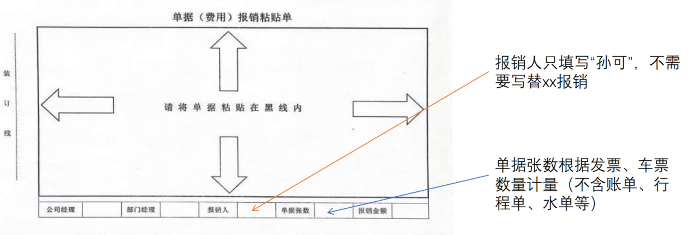
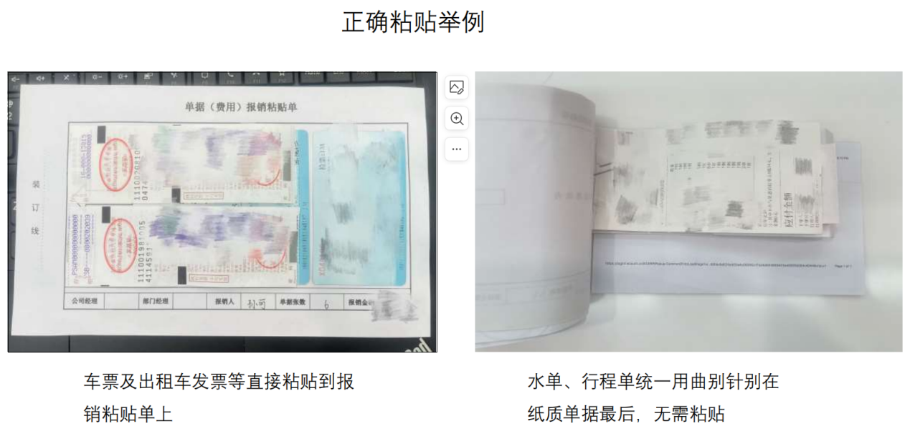
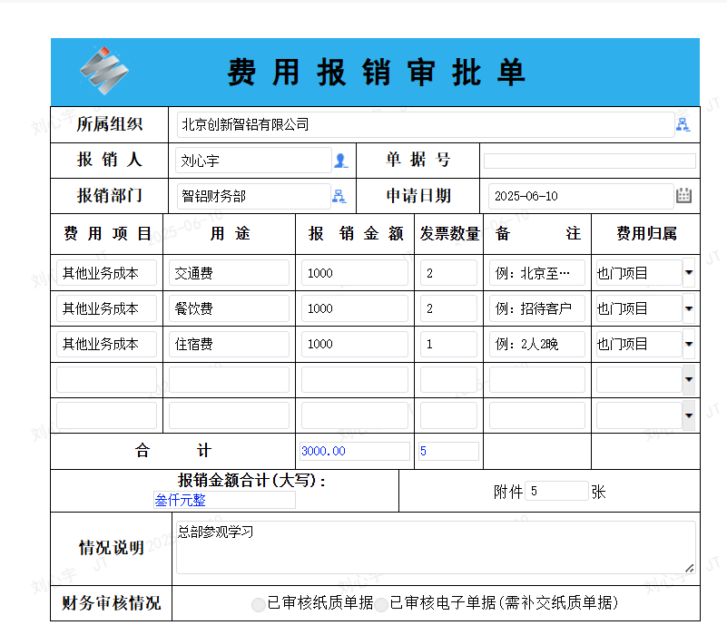
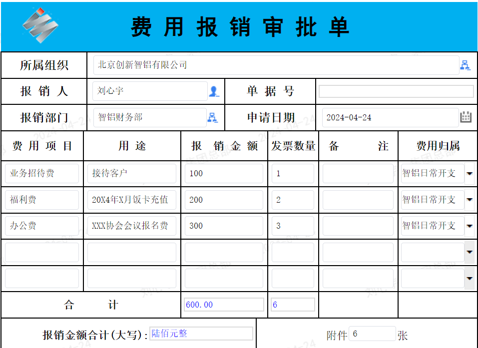
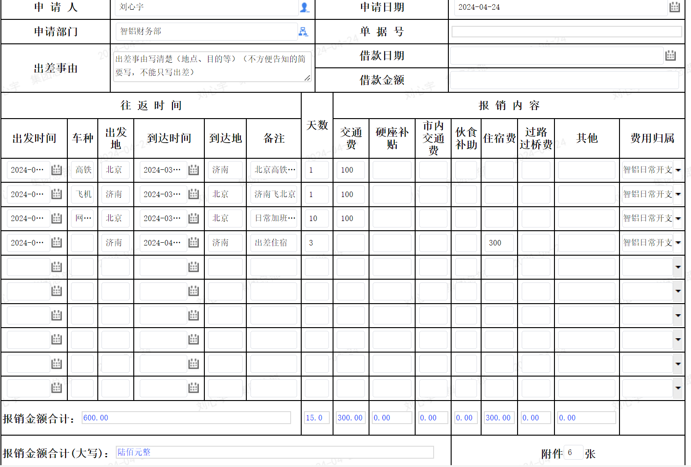

# 报销流程（更新版）
*适用于北京办公室，从集团口径的报销*

---

## 目录
1. [开票信息](#openinfo)  
2. [报销种类](#reimburse-types)  
   - [沙特、印尼、也门等其他项目](#other-projects)  
   - [智铝日常](#zhilv-daily)  
3. [Excel 表格汇总](#excel-summary)  
4. [票据整理](#bills-organization)  
5. [线上流程](#online-process)  
   - [注意事项](#precautions)  
   - [实习生或新材同事集团报销](#interns-group-reimburse)  
   - [沙特、印尼等其他项目 - 费用报销单样例](#other-projects-example)  
   - [智铝日常 - 报销单样例](#zhilv-examples)

---

## 1. 开票信息

**中文**  
> 名称：山东创新集团（青岛）国际供应链管理有限公司  
> 税号：91370281MAC41WEN2F  
> 地址：山东省青岛市胶州市上合示范区核心区闽江路16号302室  
> 电话：18854390588  
> 银行信息：中国银行股份有限公司青岛崂山支行 244247505201  

**英文**  
> Company name: SIG (Qingdao) International Supply Chain Management Co., Ltd.  
> Tax ID Number: 91370281MAC41WEN2F

---

## 2. 报销种类

### 基本规则
1. 不同项目分别提交报销单（例如：智铝日常 **不能** 和沙特项目合并）。  
2. **沙特、印尼、也门等其他项目**：因公费用全部归于**费用报销单**。  

### 沙特、印尼、也门等其他项目

| 费用项目 | 用途 | 备注 |
|----------|------|------|
| 其他业务成本 | 交通费-机票 | 机票、机票保险费、退票、改签、升舱、换座、行李托运、签证费用。如特殊情况需要乘坐商务舱需要在情况说明栏说明情况。 |
| 其他业务成本 | 住宿费 | 出差酒店费用及相关服务费用（洗衣费、国外酒店税费）；住宿费需附水单（水单不算做附件张数，分开整理）；酒店账单显示的公司名称请和报销公司及开票单位保持一致。 |
| 其他业务成本 | 餐饮费 | 因接待客户的餐饮，出差使用的餐费；出差酒店单独开具的bar 小食；餐费需附水单原件。 |
| 其他业务成本 | 交通费-火车 汽车 | 火车票、汽车票、船票等。如特殊情况需要乘坐高铁一等座、商务座需要在情况说明栏说明情况。 |
| 其他业务成本 | 交通费-出租、自行开车 | 网约车需后附行程单（行程单算作附件张数，附在发票后面）自行开车报销加油费需付里程数 |
| 其他业务成本 | 通讯费 | 电话卡 |
| 其他业务成本 | 办公费 | 购买的办公用品 |
| 其他业务成本 | 快递物流费 | 快递费及其他小额物流费 |
| 其他业务成本 | 招待费 | 因接待客户的礼品、门票、导游费、spa、娱乐费、生活服务费等，需附明细单。客户的体检、挂号、买药就医等费用；沙特项目不能报销酒的发票。 |
| 其他业务成本 | 租赁费 | 出差、业务招待等租车费费用。（海外出差当地开具的收据报销需用原件） |

3. **智铝日常**：分为 **费用报销单** 与 **差旅报销单** 两类。

### 智铝日常（费用报销单 / 差旅报销单）

| 费用报销单 | 报销内容 | 差旅报销单 | 报销内容 |
|------------|----------|------------|----------|
| 业务招待费 | 因接待客户的餐饮及礼品，出差使用的餐费；餐费需附水单（水单不算做附件张数，分开整理。） | 交通费 | 机票、火车票、汽车票、船票、外地打车费、外地公共交通费（地铁公交等）、机票保险费、退票、改签、升舱、换座、行李托运、加油费（附里程图）、停车费等费用；网约车需附行程单。 |
| 租赁费 | 出差、业务招待等租车费费用； | 住宿费 | 出差酒店费用及相关服务费用（洗衣费）；住宿费需附酒店水单。 |
| 办公费 | 购买的办公用品（含电话卡）、参加会议的会议费用、考试费等； | - | - |
| 通讯费 | 电话卡 | - | - |
| 福利费 | 员工聚餐、饭卡充值、生日卡。 | - | - |
| 快递物流费 | 快递费及其他小额物流费 | - | - |

---

## 3. Excel《报销申请表》汇总

1. 申请人需如实填写《报销申请表》（excel），每张发票对应一行，不得汇总填写。费用报销单和差旅报销单需要分别汇总提交。

2. 将需报销的费用（需与发票金额完全一致；如实际支付与发票金额不一致时，请提供实际支付金额截图，并根据实际支付报销）按照费用归属分类（如餐饮、火车票、办公费等）顺序分别整理到费用报销单和差旅报销单中。Excel《报销申请表》表格中类别需与OA系统中类别保持一致，并且按照分类顺序汇总。
3. 整理完成Excel后打印作为纸质单据首页，并且作为附件上传至OA系统中。 
4. 费用报销单尽量不要体现领导名字；
5. 如涉及外币，需在“金额”前体现汇率，按照报销当月1号的中国银行汇率或实际汇率（需提供人民币支付截图）计算。
若中国银行不显示相应外币，请参考国家外汇管理局当月1号汇率。
 查询：[中国银行汇率](https://srh.bankofchina.com/search/whpj/search_cn.jsp)（示例网址）  

---

## 4. 票据整理（所有材料 A5 纸打印）

1. 将电子发票以A5纸打印出来，按照表格汇总顺序粘贴到《单据（费用）报销粘贴单》上（左上角粘贴），且宽度不能大于粘贴单，水单另附，不要粘贴到发票及报销粘贴单上。打车行程单需粘贴在对应发票后面，一并贴在粘贴单上。  

2. 费用报销单和差旅报销单需要分别汇总提交。
3. 若无发票使用替票，请书面说明替票原因并申请领导签字。替票后，线上报销分类，请按照替票类型填写。如，某次包车费用无法开具发票，使用餐饮替票，则线上分类汇总时，按照餐饮处理。

4. 将之前准备好的费用明细单（Excel）打印并附到报销单据最上面。 
5. 单据张数根据发票、车票、行程单、海外发票、外币支付记录截图等贴在粘贴单上的单据数量统计，不含转账记录（人民币）、水单等。
6. 请在所有发票背面（纸质火车票签在正面空白处，电子火车票依旧背面）用“黑色签字笔”签名，实习生签自己本人真实姓名。
7. 海外单据报销：需提供当地 tax receipt/tax invoice 原件或国内开具公司抬头发票。  
   - ①境外消费需要当地的tax receipt/tax invoice原件或者是国内开具的公司抬头的发票。
   - ②外币汇兑汇率
     - 1)汇率为报销当月1号中国银行汇率：仅把发票原件粘贴到单据（费用）报销粘贴单上；后附行程单等其他支持性材料，用曲别针别在所有单据后面。
     - 2)汇率为实际支付汇率：需额外提供支付记录截图，把发票原件、POS机付款小票与支付记录截图对应好统一粘贴并粘贴到单据（费用）报销粘贴单上。
8. 报销人填写对应 OA 账号所属人姓名 **（不要写“替 XXX 报销”, 直接签署报销人姓名）**。 **单据张数根据发票、车票、行程单、海外支付截图、海外支付记录数量统计（不含国内支付记录、国内水单等）**
> 
> 

---

## 5. 线上流程

### 注意事项
1. **表格选择**：  
   - 1)若报销种类为“费用报销单”，登录OA后，选择“（财务01）创新智铝费用报销审批单” ；
   - 2)若报销种类为“差旅报销单”，登录OA后，选择“（财务02）创新智铝出差旅费报销单”。 
2. 单据上传：请将表格汇总中整理的Excel明细表和所有发票、水单等纸质单据上传。注意上传时不可打包为zip文件，需所有单据分别上传。  
3. 附件张数：需与纸质单据中“单据张数”、OA系统中发票张数保持一致。
4. 线上表格填写：由于线上表格只有5或10行限制，因此可以按分类汇总填写，无需与excel中每行对应，但分类和总计金额需一致。分类要求参考上述.
5. 因公出差需要情况说明栏简单写一下事由；
6. 住宿费备注栏写明几人几间几晚；

### 实习生或新材同事集团报销
1. 因报销需用智铝行政（ZLXZ）账号代为申请，所以Excel、线上有署名的地方全部填写行政部；
2. 请在情况说明中，备注“实习生（姓名）因（原因）需报销，收款账户：XXX，银行账号：XXXXXX；开户行：XXXXXXX”。

### 沙特、印尼等其他项目 - 费用报销单样例

### 智铝日常 - 报销单样例

1. 费用报销审批单样例：  
   

2. 出差差旅费用报销单样例：  
   

